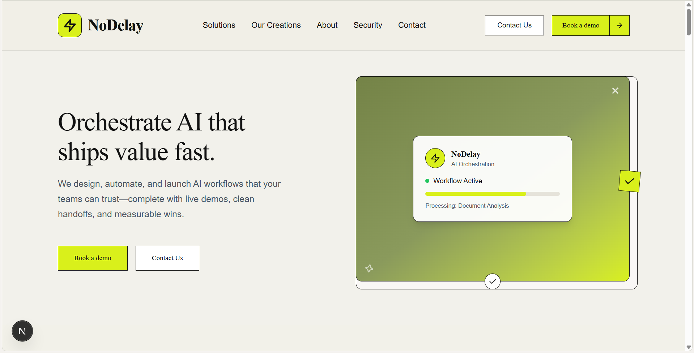
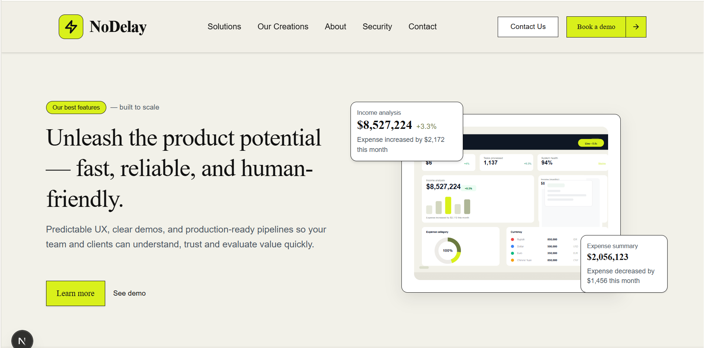
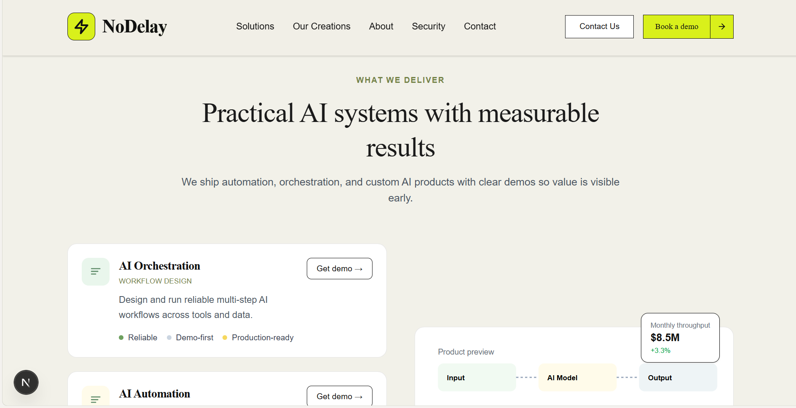

# NoDelay — AI Orchestration Site

Preview




## Overview
NoDelay designs, automates, and launches AI workflows with live demos, clean handoffs, and measurable wins.

## Tech stack
- Next.js (App Router) with TypeScript
- Tailwind CSS for styling
- React hooks (IntersectionObserver) for scroll animations
- Custom SVG previews for product mockups

## Key features
- Hero, value, and action sections matching the NoDelay lime/olive brand palette
- Scroll-triggered animations with reduced-motion support
- Interactive layout toggles for use-case stories
- SVG dashboard and workflow previews tailored to the site theme

## Getting started
Install dependencies and run the dev server:
```bash
npm install
npm run dev
```
Then visit http://localhost:3000.

## Scripts
- `npm run dev` — start the dev server
- `npm run build` — create the production build
- `npm run start` — run the production build locally
- `npm run lint` — run ESLint checks

## Project structure
- app/ — Next.js app router entrypoints
- src/components/sections — marketing sections (hero, value cards, action features, etc.)
- src/components/ui — shared UI primitives
- public/ — static assets (add site-preview.png here)

## Environment
Create a .env.local file for any secrets or API keys you need. Keep secrets out of version control.

## Deployment
Build and run locally:
```bash
npm run build
npm run start
```
Deploy to your preferred host (Vercel recommended for Next.js). Ensure environment variables are configured in the host settings.

## Contributing
1) Fork and clone the repo
2) Create a feature branch
3) Commit with clear messages
4) Open a PR with context and screenshots when UI changes are made
